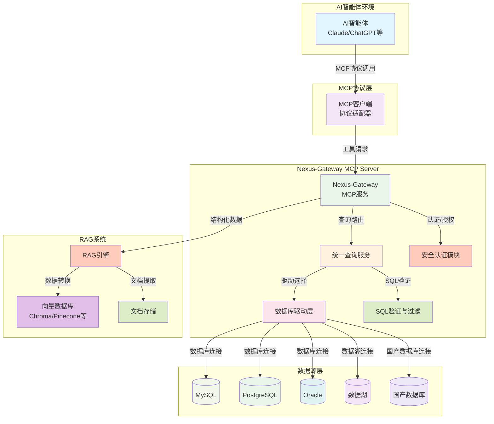
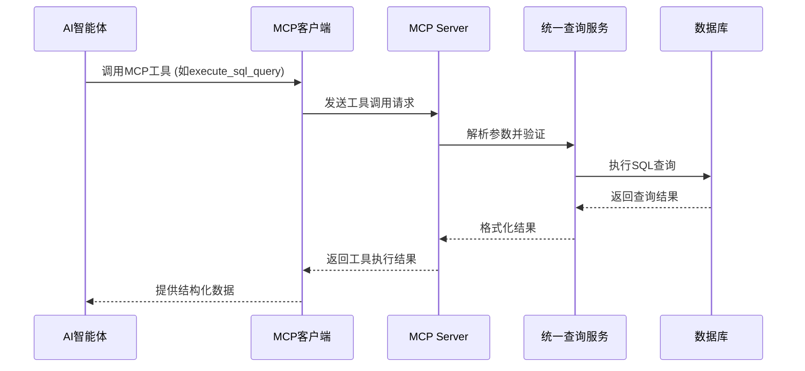

# Nexus-Gateway MCP Server 架构设计

## AI智能体与RAG集成架构图

```mermaid
graph TB
    subgraph "AI智能体环境"
        A[AI智能体<br/>Claude/ChatGPT等] 
    end
    
    subgraph "MCP协议层"
        B[MCP客户端<br/>协议适配器]
    end
    
    subgraph "Nexus-Gateway MCP Server"
        C[Nexus-Gateway<br/>MCP服务]
        D[统一查询服务]
        E[数据库驱动层]
        F[安全认证模块]
        G[SQL验证与过滤]
    end
    
    subgraph "数据源层"
        H[(MySQL)]
        I[(PostgreSQL)]
        J[(Oracle)]
        K[(数据湖)]
        L[(国产数据库)]
    end
    
    subgraph "RAG系统"
        M[RAG引擎]
        N[向量数据库<br/>Chroma/Pinecone等]
        O[文档存储]
    end
    
    A -- "MCP协议调用" --> B
    B -- "工具请求" --> C
    C -- "查询路由" --> D
    C -- "认证/授权" --> F
    D -- "SQL验证" --> G
    D -- "驱动选择" --> E
    E -- "数据库连接" --> H
    E -- "数据库连接" --> I
    E -- "数据库连接" --> J
    E -- "数据湖连接" --> K
    E -- "国产数据库连接" --> L
    
    C -- "结构化数据" --> M
    M -- "数据转换" --> N
    M -- "文档提取" --> O
    
    style A fill:#e1f5fe
    style B fill:#f3e5f5
    style C fill:#e8f5e8
    style D fill:#fff3e0
    style E fill:#fce4ec
    style F fill:#ffccbc
    style G fill:#dcedc8
    style H fill:#f1f8e9
    style I fill:#e8f5e8
    style J fill:#e0f2f1
    style K fill:#f3e5f5
    style L fill:#ede7f6
    style M fill:#ffccbc
    style N fill:#e1bee7
    style O fill:#dcedc8
```

## MCP工具调用流程

```mermaid
sequenceDiagram
    participant AI as AI智能体
    participant MCP_Client as MCP客户端
    participant MCP_Server as MCP Server
    participant Query_Service as 统一查询服务
    participant DB as 数据库
    
    AI->>MCP_Client: 调用MCP工具 (如execute_sql_query)
    MCP_Client->>MCP_Server: 发送工具调用请求
    MCP_Server->>Query_Service: 解析参数并验证
    Query_Service->>DB: 执行SQL查询
    DB-->>Query_Service: 返回查询结果
    Query_Service-->>MCP_Server: 格式化结果
    MCP_Server-->>MCP_Client: 返回工具执行结果
    MCP_Client-->>AI: 提供结构化数据
```

## RAG数据流路径

```mermaid
graph LR
    subgraph "AI智能体"
        A[查询意图]
    end
    
    subgraph "MCP数据提取"
        B[execute_sql_query工具]
        C[数据源连接]
        D[查询执行]
        E[结果格式化]
    end
    
    subgraph "RAG处理"
        F[数据清洗]
        G[分块处理]
        H[向量化]
        I[存储到向量库]
    end
    
    subgraph "知识检索"
        J[相似性搜索]
        K[上下文组装]
        L[AI生成]
    end
    
    A --> B
    B --> C
    C --> D
    D --> E
    E --> F
    F --> G
    G --> H
    H --> I
    I --> J
    J --> K
    K --> L
    
    style A fill:#e1f5fe
    style B fill:#f3e5f5
    style C fill:#e8f5e8
    style D fill:#fff3e0
    style E fill:#fce4ec
    style F fill:#ffccbc
    style G fill:#dcedc8
    style H fill:#c8e6c9
    style I fill:#b2ebf2
    style J fill:#b39ddb
    style K fill:#ce93d8
    style L fill:#f48fb1
```