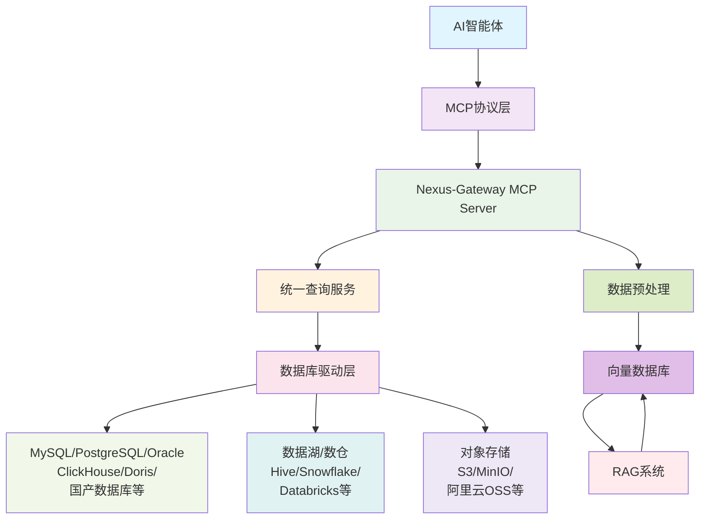

# Nexus-Gateway MCP Server - AI智能体数据库连接器

## 产品概述

Nexus-Gateway MCP Server是专为AI智能体设计的数据库连接中间件，通过Model Context Protocol (MCP)协议，让AI模型能够直接访问和查询各种数据库系统。该服务提供统一的数据访问接口，支持多种数据库类型，实现智能化的数据检索与分析能力。

## AI智能体与RAG集成架构



## 核心功能

### 1. 多数据库统一接入
- 支持传统关系型数据库（MySQL、PostgreSQL、Oracle、SQL Server等）
- 支持大数据平台（Hive、Spark、Hadoop等）
- 支持国产数据库（达梦、人大金仓、南大通用等）
- 支持云原生数据库（TiDB、OceanBase等）

### 2. 智能查询优化
- 自动SQL优化与重写
- 查询性能监控与分析
- 结果缓存与预热
- 并发控制与限流

### 3. AI智能体集成
- MCP协议标准兼容
- 自然语言转SQL能力
- 智能数据发现
- 上下文感知查询

### 4. RAG数据支持
- 结构化数据向量化
- 数据源实时同步
- 智能切片与索引
- 相似度检索优化

## MCP工具接口

### 1. list_data_sources
- 功能：列出所有已配置的数据源
- 用途：AI智能体发现可用数据源

### 2. execute_sql_query
- 功能：执行SQL查询
- 用途：AI智能体直接查询数据

### 3. get_data_source_info
- 功能：获取数据源详细信息
- 用途：AI智能体了解数据源结构

### 4. validate_sql_query
- 功能：验证SQL查询语法
- 用途：AI智能体安全查询验证

### 5. list_tables
- 功能：列出数据源中的所有表
- 用途：AI智能体探索数据结构

## 部署指南

### 环境要求
- Go 1.21+
- 支持的数据库系统
- MCP兼容的AI客户端

### 快速启动

1. 克隆项目
```bash
git clone https://github.com/your-repo/nexus-gateway.git
```

2. 配置MCP服务
```yaml
# configs/config.yaml
mcp:
  enabled: true
  transport: "stdio"  # 或 "http"
  port: "8090"
  host: "0.0.0.0"
```

3. 启动服务
```bash
go run ./cmd/server/main.go
```

## AI智能体集成示例

### Claude Desktop集成
1. 启动Claude Desktop
2. 在设置中启用MCP功能
3. 配置Nexus-Gateway MCP Server
4. AI智能体即可访问您的数据库

### 自定义AI应用集成
```go
// 示例：在AI应用中调用MCP工具
client := mcp.NewClient("nexus-gateway-mcp-server")
result, err := client.CallTool("execute_sql_query", map[string]interface{}{
    "datasource_id": "my-mysql-db",
    "sql": "SELECT * FROM users WHERE age > 25",
})
```

## 安全与权限

- 数据库连接加密
- 查询权限控制
- SQL注入防护
- 审计日志记录
- 用户认证授权

## 使用场景

### 1. 企业数据分析助手
AI智能体通过MCP协议访问企业内部数据库，自动生成业务报告和数据洞察。

### 2. RAG知识库增强
将结构化数据集成到RAG系统中，提供更准确的事实性回答。

### 3. 数据治理与发现
AI智能体自动发现和分析企业数据资产，构建数据目录。

### 4. 智能报表生成
基于自然语言指令自动生成复杂的业务报表。

## 技术优势

- **标准化协议**：遵循MCP协议标准，兼容主流AI平台
- **统一接口**：屏蔽底层数据库差异，提供一致访问体验
- **高性能**：优化的查询执行引擎，支持大数据量处理
- **可扩展性**：插件化架构，易于扩展新的数据源
- **安全性**：多层次安全机制，保护敏感数据

## 社区与支持

- 文档：[详细使用文档](./MCP_DOCUMENTATION.md)
- 示例：[集成示例代码](./examples/)
- 支持：[问题反馈](https://github.com/your-repo/nexus-gateway/issues)

## 贡献

欢迎提交Issue和Pull Request来帮助改进Nexus-Gateway MCP Server！

---

<p align="center">
  <em>赋能AI智能体，连接数据世界</em>
</p>